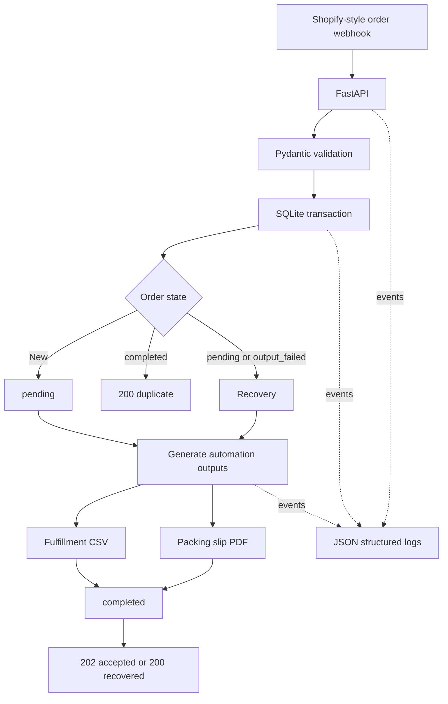

# Shopify Order Automation & API Integration

**Role:** Python / Shopify Integration Developer

A backend automation service that receives realistic Shopify-style order
webhooks, validates and normalizes the payload, stores orders idempotently, and
generates fulfillment-ready CSV and PDF documents. Reliability state and
recovery logic prevent a partial filesystem failure from leaving an order
permanently incomplete.

> [!IMPORTANT]
> Shopify is simulated with realistic webhook payloads. This V1 does not
> connect to a live Shopify store and is not presented as a production Shopify
> app.

## Project highlights

- FastAPI webhook and health endpoints with interactive OpenAPI documentation.
- Nested Pydantic validation for customers, line items, timestamps, and money.
- Transactional SQLite persistence for orders and line items.
- Idempotency enforced by the Shopify-style `order_id`.
- Deterministic fulfillment CSV and packing slip PDF generation.
- Persistent processing states and recovery after partial output failure.
- JSON structured logging without customer data or complete payloads.
- Stable HTTP errors and 23 isolated pytest tests.

## Architecture



## API

### Health check

```http
GET /health
```

Response: `200 OK`

```json
{
  "status": "ok"
}
```

### Order webhook

```http
POST /webhooks/orders/create
Content-Type: application/json
```

Example payload, also available as
[`tests/fixtures/shopify_order.json`](tests/fixtures/shopify_order.json):

```json
{
  "id": 123456789,
  "email": "customer@example.com",
  "created_at": "2026-09-23T12:00:00Z",
  "currency": "USD",
  "total_price": "149.98",
  "customer": {
    "first_name": "John",
    "last_name": "Doe"
  },
  "line_items": [
    {
      "sku": "UMBRA-BLK",
      "title": "Umbra Black",
      "quantity": 2,
      "price": "74.99"
    }
  ]
}
```

First successful delivery: `202 Accepted`

```json
{
  "status": "accepted",
  "order_id": 123456789
}
```

Repeated delivery after completion: `200 OK`

```json
{
  "status": "duplicate",
  "order_id": 123456789
}
```

Repeated delivery after an incomplete output attempt: `200 OK`

```json
{
  "status": "recovered",
  "order_id": 123456789
}
```

FastAPI returns `422` for invalid payloads, `503` for persistence failures, and
`500` when output generation fails after persistence. Internal exceptions are
not returned to the caller.

## Reliability and recovery

SQLite and the filesystem cannot participate in one atomic transaction. This
project records the processing outcome explicitly instead of pretending they
can:

```text
pending -> completed
pending -> output_failed
output_failed -> completed
```

An order is marked `completed` only after both its CSV and PDF exist. If output
generation fails, a later webhook for the same `order_id` reloads the original
order from SQLite and regenerates both deterministic files. The order and line
items are never inserted twice. If a repeated payload conflicts with stored
data, SQLite remains authoritative and the persisted values are used for
recovery.

Completed duplicates do not touch existing files.

## Automation outputs

Runtime files are written to the ignored `outputs/` directory:

```text
outputs/
  order_<order_id>_fulfillment.csv
  order_<order_id>_packing_slip.pdf
```

The CSV contains one row per line item. The PDF contains the order metadata,
customer, products, quantities, SKUs, total, currency, and page numbering.

Versioned examples generated from the fixture through the real application
code are available here:

- [Sample fulfillment CSV](docs/samples/order_123456789_fulfillment.csv)
- [Sample packing slip PDF](docs/samples/order_123456789_packing_slip.pdf)

## Structured logging

Application events are emitted as JSON Lines with fields such as `timestamp`,
`level`, `event`, `status`, `order_id`, and `error_type`. Events cover webhook
receipt, acceptance, duplicate detection, persistence errors, output failures,
and recovery. Full payloads, customer details, and filesystem paths are
deliberately excluded.

## Project structure

```text
app/
  __init__.py
  database.py          # SQLite schema, transactions, state, and reads
  logging_config.py    # JSON structured logging
  main.py              # FastAPI app and webhook orchestration
  models.py            # Pydantic request and response models
  outputs.py           # CSV and PDF generation
docs/
  samples/
    order_123456789_fulfillment.csv
    order_123456789_packing_slip.pdf
tests/
  fixtures/
    shopify_order.json
  test_api.py
  test_reliability.py
.gitignore
README.md
requirements.txt
```

## Local setup

Requires Python 3.10 or newer.

### Windows PowerShell

```powershell
python -m venv .venv
.\.venv\Scripts\Activate.ps1
python -m pip install -r requirements.txt
uvicorn app.main:app --reload
```

### macOS / Linux

```bash
python3 -m venv .venv
source .venv/bin/activate
python -m pip install -r requirements.txt
uvicorn app.main:app --reload
```

Open the interactive API documentation at
[http://127.0.0.1:8000/docs](http://127.0.0.1:8000/docs). The OpenAPI schema is
available at `http://127.0.0.1:8000/openapi.json`.

## Quick demo workflow

1. Start the API with `uvicorn app.main:app --reload`.
2. Open `http://127.0.0.1:8000/docs`.
3. Expand `POST /webhooks/orders/create` and select **Try it out**.
4. Paste the JSON from `tests/fixtures/shopify_order.json` and execute it.
5. Confirm the `202 accepted` response.
6. Inspect the generated CSV and PDF under `outputs/`.
7. Execute the same request again.
8. Confirm the `200 duplicate` response and that no database rows or files were
   regenerated.

Recovery from an output failure is covered deterministically by the automated
test suite and does not require a reviewer to break the filesystem manually.

## Tests

```powershell
python -m pytest -q
```

Verified result:

```text
23 passed, 1 warning
```

Tests use isolated temporary SQLite databases and output directories. They
cover validation, transaction rollback, persistence, idempotency, multiple
orders, output contents, failure states, repeated recovery attempts, conflicting
payloads, structured events, and schema upgrade behavior.

## Portfolio screenshots

No screenshots are fabricated or stored in this repository. Suggested captures
for a portfolio listing:

1. FastAPI Swagger UI at `/docs` showing both endpoints.
2. A terminal showing the green pytest suite.
3. The sample fulfillment CSV opened in a spreadsheet application.
4. The sample packing slip PDF rendered in a PDF viewer.

Suggested filenames are `fastapi-docs.png`, `pytest-green.png`,
`fulfillment-csv.png`, and `packing-slip-pdf.png`.

## Skills demonstrated

- Python and FastAPI backend development
- Shopify-style webhook and API integration design
- Pydantic validation and normalization
- SQLite transactions and relational modeling
- Idempotency and processing-state recovery
- CSV and PDF automation
- Structured logging and stable error handling
- pytest integration and reliability testing

## V1 limitations and production extensions

This repository is a local portfolio V1. A production Shopify integration would
add, based on operational requirements:

- Shopify webhook HMAC verification.
- Shopify Admin GraphQL API integration.
- OAuth and Shopify app installation flow.
- Secret management and environment-specific configuration.
- PostgreSQL or another production database.
- Deployment, TLS, monitoring, and operational alerting.
- Background processing if traffic volume or latency requirements justify it.

Those capabilities are intentionally documented rather than partially
implemented here.
